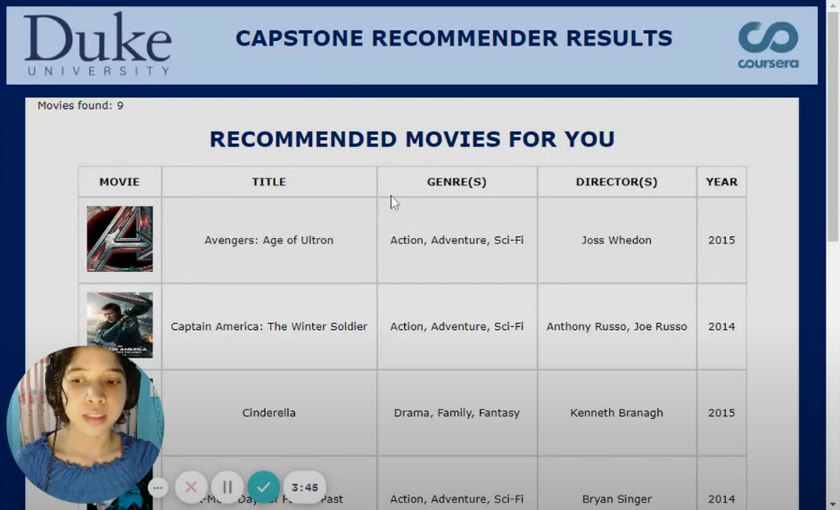

# Recommendation System 
### _Get recommended movies based on calculated preferences_

The system works with datasets with data for movies and user ratings. The program answers questions about input data, including which items should be recommended to a user based on their ratings of several movies and on the ratings of users with similar preferences. 

## Features
Given input files on users ratings and movie titles, you will be able to:
1. Read in and parse data into lists and maps;
2. Calculate average ratings;
3. Calculate how similar a given rater is to another user based on ratings; and
4. Recommend movies to a given user based on ratings. 
5. Display recommended movies for a given user on a webpage.

## Tech

The system uses a number of tools to work properly:

- [Java][java] - a class-based, object-oriented programming language.
- CSV files with data about [user ratings](/data/ratings.csv) and [rated movies](/data/ratedmoviesfull.csv).

## Adittional 

If you would like to know more about the project and its functionalities:

| Resource | URL|
| ------ | ------ |
| Demo video on Youtube | [Recommendation system - Demo video][youtube-demo] |
| Project-centered course | [Java Programming: Build a Recommendation System][course] |

**Any feedback is always welcome!**

[//]: # (These are reference links used in the body of this note and get stripped out when the markdown processor does its job.)

   [Java]: <https://www.java.com/>

   [youtube-demo]: <https://www.youtube.com/watch?v=nv8laUUS8MY>
   [course]: <https://www.coursera.org/learn/java-programming-recommender>
